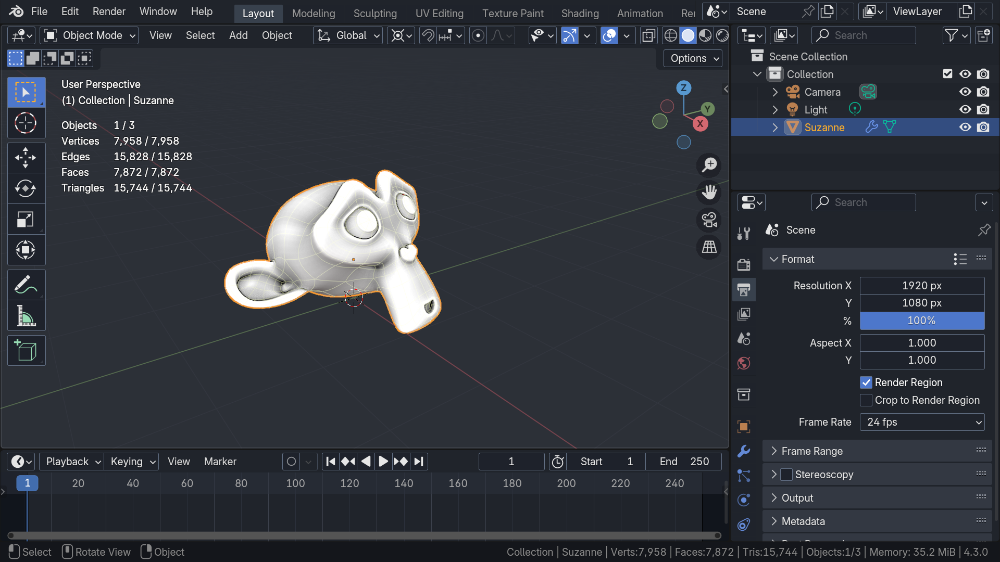

# Atom One Dark

[Download](https://extensions.blender.org/themes/theme-atom-one-dark/)

Dark theme inspired by Atom's One Dark theme.

Background and Selection (Blue) are picked from Atom's One Dark Theme. Some of the gizmo colors have been changed too. Rest of the colors are using blender's defaults so switching to this theme should be easy.

The front face color has also been changed to transparent, so you can model with "Face Orientation" turned on, without being overwhelmed by the blue color. Only back faces will be highlighted in red.

